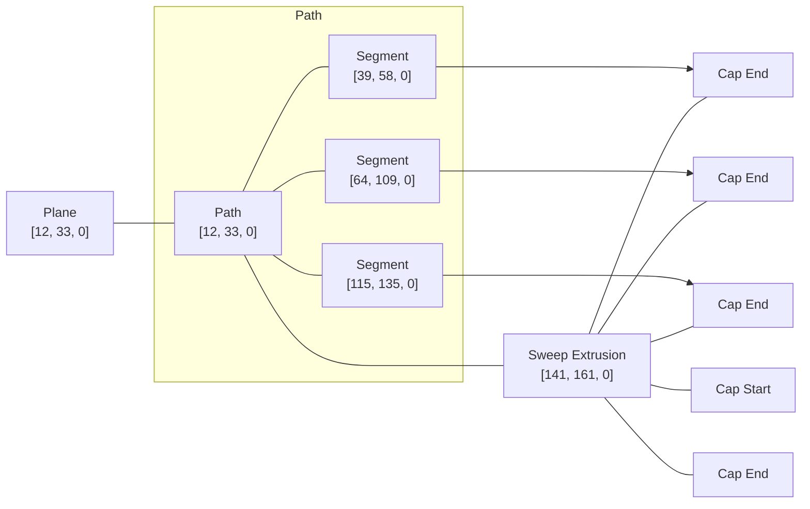

```mermaid
flowchart LR
  subgraph path2 [Path]
    2["Path<br>[12, 33, 0]"]
    3["Segment<br>[39, 58, 0]"]
    4["Segment<br>[64, 109, 0]"]
    5["Segment<br>[115, 135, 0]"]
  end
  1["Plane<br>[12, 33, 0]"]
  6["Sweep Extrusion<br>[141, 161, 0]"]
  7["Cap End"]
  8["Cap End"]
  9["Cap End"]
  10["Cap Start"]
  11["Cap End"]
  1 --- 2
  2 --- 3
  2 --- 4
  2 --- 5
  2 ---- 6
  3 x--> 7
  4 x--> 8
  5 x--> 9
  6 --- 7
  6 --- 8
  6 --- 9
  6 --- 10
  6 --- 11
```
